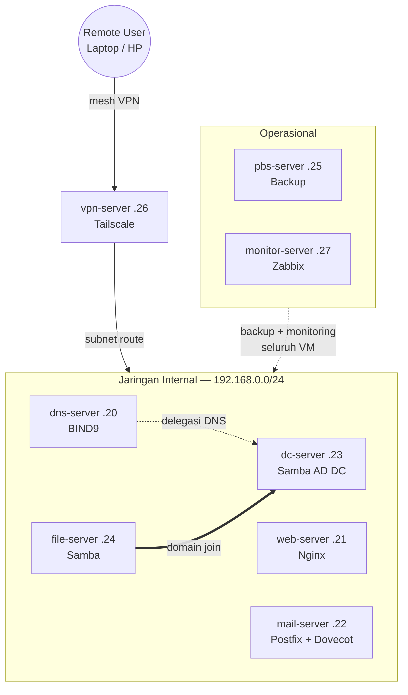

# Homelab SME Infrastructure

Simulasi infrastruktur IT kantor kecil-menengah (SME) yang dibangun dari nol di atas satu mini PC menggunakan Proxmox VE sebagai hypervisor. Proyek ini mencakup 8 layanan yang saling terintegrasi oleh DNS, web hosting multi-domain, mail server, Active Directory, file sharing, backup, remote access VPN, dan monitoring. Tujuan dari proyek ini adalah meniru bagaimana infrastruktur kantor kecil sesungguhnya dibangun dan saling terhubung.

## Latar Belakang

Proyek ini dikerjakan sebagai proyek belajar mandiri untuk memperdalam pemahaman administrasi sistem sekaligus menjadi portofolio praktis untuk peran IT infrastructure / system administrator.

## Spesifikasi Hardware

| Komponen | Spesifikasi |
|---|---|
| Perangkat | Dell OptiPlex 3050 Micro |
| CPU | Intel Core i5-7500T |
| RAM | 16 GB |
| Storage | 256 GB SSD |
| Hypervisor | Proxmox VE |

## Arsitektur

**Catatan arsitektur:**
- **Remote access**: perangkat luar terhubung lewat Tailscale mesh VPN ke `vpn-server`, yang meneruskan (subnet route) ke seluruh jaringan `192.168.0.0/24`.
- **Identity**: `dns-server` mendelegasikan resolusi domain `corp.homelab.internal` ke `dc-server`; `file-server` merupakan domain member AD (autentikasi share via grup Active Directory). `mail-server` belum diintegrasikan ke AD.
- **Operasional**: `pbs-server` dan `monitor-server` masing-masing menjangkau seluruh VM di LAN untuk backup terjadwal dan monitoring digambarkan sebagai satu koneksi ke grup, bukan per-VM, supaya diagram tetap terbaca.

## Daftar Layanan

| VM | IP | Layanan | Fungsi |
|---|---|---|---|
| dns-server | 192.168.0.20 | BIND9 | DNS otoritatif untuk `homelab.internal` dan `familypet.com`, dengan delegasi ke domain AD |
| web-server | 192.168.0.21 | Nginx | Hosting multi-domain (multi-site) dengan HTTPS self-signed dan security headers |
| mail-server | 192.168.0.22 | Postfix, Dovecot, Roundcube | Mail server internal lengkap dengan webmail, SSL end-to-end |
| dc-server | 192.168.0.23 | Samba AD DC | Directory Server identity management terpusat (realm `CORP.HOMELAB.INTERNAL`) |
| file-server | 192.168.0.24 | Samba (domain member) | File sharing dengan permission berbasis grup Active Directory |
| pbs-server | 192.168.0.25 | Proxmox Backup Server | Backup terjadwal + deduplikasi untuk seluruh VM, dengan retention policy |
| vpn-server | 192.168.0.26 | Tailscale | Remote access ke seluruh jaringan internal dari luar |
| monitor-server | 192.168.0.27 | Zabbix | Monitoring terpusat + alerting untuk seluruh infrastruktur |

## Fitur yang Diimplementasikan

**DNS Server**
- Zone otoritatif ganda (`homelab.internal`, `familypet.com`)
- Delegasi DNS ke domain Active Directory (`corp.homelab.internal`) dengan glue record
- Reverse DNS (PTR) yang dirapikan sesuai konvensi 1 PTR per IP

**Web Server**
- Multi-site hosting dengan Nginx server block
- Dummy `default_server` untuk menolak akses langsung via IP (security hardening)
- HTTPS self-signed untuk seluruh domain, dengan redirect otomatis HTTP ke HTTPS
- Security headers (`X-Frame-Options`, `X-Content-Type-Options`, `server_tokens off`)

**Mail Server**
- Postfix (SMTP) + Dovecot (IMAP/POP3) + Roundcube (webmail)
- SSL/TLS end-to-end (Dovecot dan Apache/Roundcube)
- Konfigurasi `mynetworks` dibatasi internal-only (bukan open relay)

**Directory Server**
- Samba Active Directory Domain Controller dengan realm terpisah dari domain infrastruktur (best practice)
- Kerberos authentication, LDAP user/group management
- Delegasi DNS dua arah antara BIND9 dan Samba

**File Server**
- Awalnya standalone (grup Linux lokal), kemudian di-*upgrade* menjadi domain member AD via Winbind
- Permission folder per-divisi sepenuhnya berbasis grup Active Directory
- Diverifikasi dengan multiple user, masing-masing terbatas hanya ke share sesuai keanggotaan grupnya

**Backup Server**
- Proxmox Backup Server dengan datastore terpusat
- Backup terjadwal (snapshot mode) untuk seluruh VM
- Retention policy (prune) untuk mencegah akumulasi backup tak terbatas
- Notifikasi email independen dari mail-server internal (relay via Gmail SMTP) memastikan alert tetap terkirim meski mail-server sendiri down
- Diverifikasi dengan uji restore penuh ke VM ID baru

**VPN**
- Percobaan awal dengan WireGuard (port forwarding + DDNS) gagal karena pemblokiran UDP oleh ISP/operator seluler
- Dipivot ke Tailscale sebagai subnet router NAT traversal otomatis tanpa perlu port forwarding
- Split DNS dikonfigurasi agar domain internal tetap resolve dari perangkat remote

**Monitoring**
- Zabbix Server dengan MySQL backend, memantau seluruh 8 VM via Zabbix Agent
- Email alerting untuk notifikasi otomatis

## Tantangan Teknis & Solusi

| Tantangan | Solusi |
|---|---|
| BIND9 selalu meneruskan query domain AD ke forwarder global (Google DNS), meski delegasi lokal sudah benar | Menambahkan blok `zone type forward` khusus untuk domain AD, memberi prioritas lebih tinggi dari forwarder global |
| Glue record DNS tidak terbaca meski data terlihat benar | FQDN di zone file harus diakhiri titik (`.`); tanpa itu BIND menganggapnya nama relatif |
| Cache negatif DNS membuat perubahan zone file tidak langsung terlihat | `rndc flush` untuk membersihkan cache negatif yang bisa bertahan sesuai Negative Cache TTL |
| WireGuard tidak pernah berhasil handshake meski port forwarding & DDNS sudah benar | Diagnosis sistematis (tcpdump, test TCP vs UDP, cek CGNAT) menyimpulkan ISP/operator seluler memblokir UDP non-standar; dipivot ke Tailscale |
| Kerberos gagal autentikasi saat pertama provisioning AD | Time sync antar server (chrony) wajib presisi Kerberos sangat sensitif terhadap perbedaan waktu |
| Backup PBS berpotensi menghabiskan storage tanpa batas | Menerapkan retention policy (prune) untuk membatasi jumlah backup yang disimpan |

## Yang Belum Dikerjakan (Pengembangan Lanjutan)

- Integrasi Active Directory dengan mail-server yaitu autentikasi IMAP/SMTP via AD, bukan lagi user Linux lokal
- Private Certificate Authority untuk menghilangkan warning "Not Secure" pada HTTPS internal

*Dokumentasi command-by-command yang lebih detail tersedia di [`command-reference.md`](./command-reference.md).*
